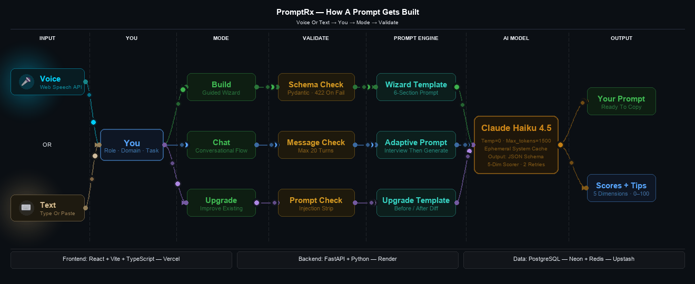
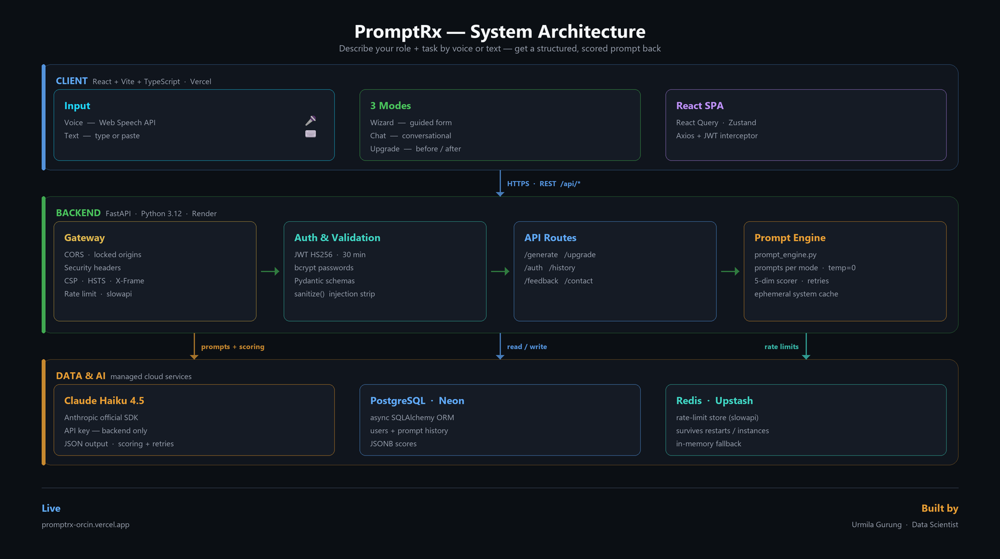

# PromptRx

**Describe your role and task — get a precision-crafted, copy-paste-ready AI prompt, scored across 5 dimensions.** No sign-up. Free.

🔗 **[Try it live → promptrx-orcin.vercel.app](https://promptrx-orcin.vercel.app/)**



## What it does

Tell PromptRx who you are and what you need — by **voice or text** — and it returns a structured prompt that works in any LLM (ChatGPT, Claude, Gemini, Copilot…), scored across 5 dimensions with tips to make it better.

Three modes:

- **Build** — a guided wizard: answer a few questions about your role, domain, and task.
- **Chat** — a conversational flow that asks follow-ups until it has enough.
- **Upgrade** — paste a rough prompt and get a before/after score showing exactly what changed.

🎙️ **Voice input** — every free-text field has a mic button (browser Web Speech API). Works in Chrome, Edge, and Safari; transcripts append to whatever you've typed.

## Architecture



A React SPA talks to a FastAPI backend over REST. The backend locks down and rate-limits every request, then the prompt engine calls Claude Haiku to generate and score the prompt. PostgreSQL stores history; Redis backs the rate limiter.

## Stack

| Layer | Tech |
|-------|------|
| Frontend | React · Vite · TypeScript → Vercel |
| Backend | FastAPI · Python 3.12 → Render |
| Database | PostgreSQL → Neon |
| Cache | Redis → Upstash |
| AI | Anthropic Claude Haiku 4.5 |

## Local development

You'll need Docker, [uv](https://docs.astral.sh/uv/), and Node 18+.

```bash
# 1. Start Postgres + Redis  (Redis is optional — the limiter falls back to memory)
docker-compose up -d postgres redis

# 2. Backend  →  http://localhost:8000
cd backend
uv sync
cp .env.example .env              # DB + Redis preset for local — just add your ANTHROPIC_API_KEY
uv run uvicorn app.main:app --reload

# 3. Frontend  →  http://localhost:5173
cd frontend
npm install
cp .env.example .env.local        # VITE_API_URL is preset to localhost:8000
npm run dev
```

Database tables are created automatically on first run — no migration step needed.

## Deploy

The frontend and backend live in this one repo and deploy separately:

### Backend → Render

Point a new Web Service at the `/backend` directory (config lives in `render.yaml`), then set:

- `ANTHROPIC_API_KEY` — your Anthropic API key
- `DATABASE_URL` — Neon Postgres connection string
- `REDIS_URL` — Upstash `rediss://` URL
- `JWT_SECRET` — 32+ random characters (the app refuses to boot with less)
- `FRONTEND_URL` — your Vercel URL (so CORS allows it)
- `ENVIRONMENT` — set to `production`. `render.yaml` does this for you, but if you create the service by hand and skip it, the API silently runs in dev mode: public `/docs`, no CSP header.
- `SMTP_USER` / `SMTP_PASSWORD` / `CONTACT_EMAIL` — optional, only the contact form uses them (`CONTACT_EMAIL` is where submissions are delivered)

### Frontend → Vercel

Point a new project at the `/frontend` directory, then set:

- `VITE_API_URL` — your Render backend URL

> Set `FRONTEND_URL` (backend) and `VITE_API_URL` (frontend) to each other's deployed URLs — that handshake is what lets them talk across origins.

## License

[MIT](LICENSE) © 2026 Urmila Gurung — free to use, modify, and fork.

---

Built by **Urmila Gurung**
